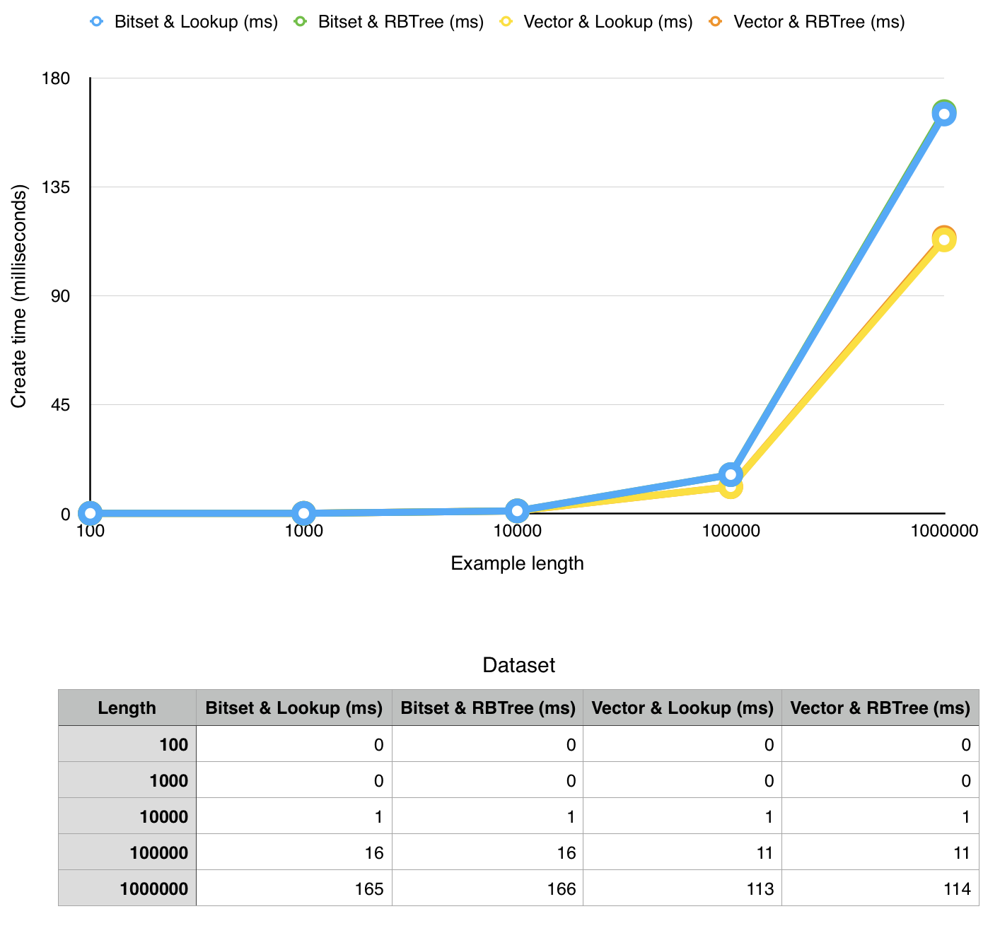
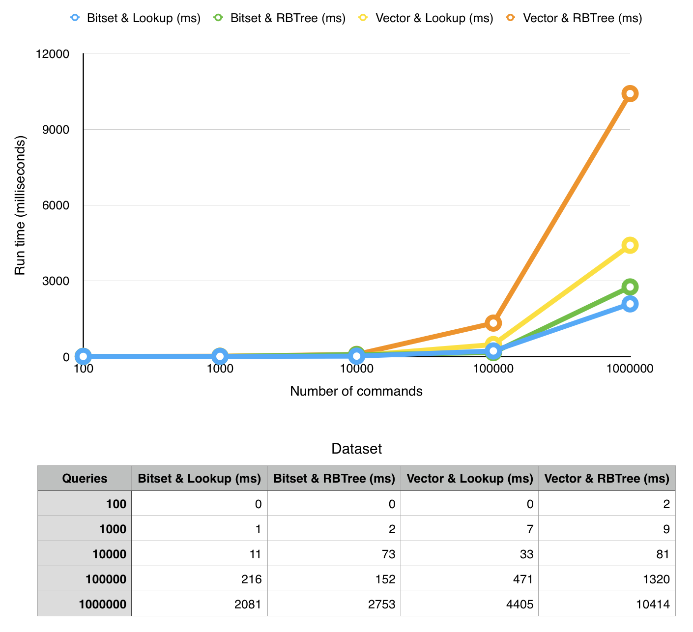
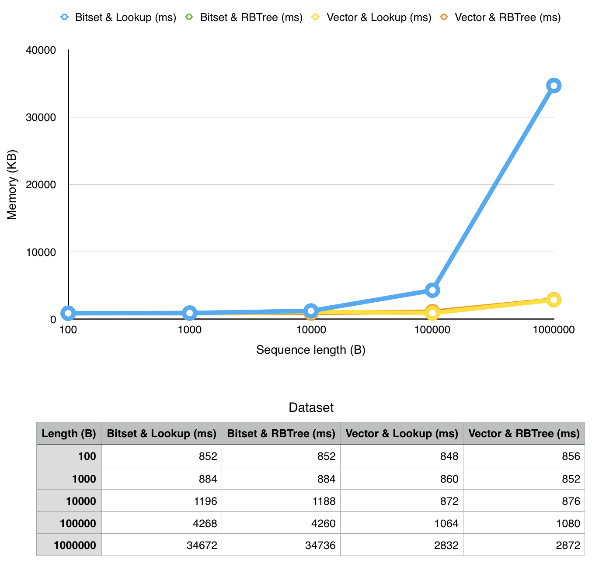

# Fast rank/select operations

[](https://img.shields.io/packagist/l/doctrine/orm.svg)

Project assignment for [Bioinformatics course](http://www.fer.unizg.hr/predmet/bio) at University of Zagreb, Faculty of Electrical Engineering and Computing (UNIZG FER), academic year 2016/2017.

## Authors
- [Filip Hrenić](https://github.com/filiphrenic)
- [Zvonimir Medić](https://github.com/admiralbulldog)
- [Matija Oršolić](https://github.com/mators)

## Implementation
The goal was to implement fast rank/select operations on huge strings (DNA). We accomplished that by using wavelet trees with custom bitset implementation.

## Instructions

#### Getting started
```bash
git clone https://github.com/filiphrenic/bioinf
cd bioinf
vagrant up
```
Use this to clone repository and to setup environment. You don't have to run ```vagrant up``` this if you have ```g++-5, wget and gunzip```.

#### Compilation
```bash
bash scripts/compile.sh
```
#### Usage
```
./bioinf [options] input_file
	-o output_file   [default=stdout]
	-c commands_file [default=stdin]
	-w word_size     [default=1024]
	-s               [show statistics]
	-v               [use bool vector instead of bitmask]
	-t               [use red-black tree instead of lookup list]
```
#### File structure
Input file must be in [FASTA format](https://en.wikipedia.org/wiki/FASTA_format)

Commands look like ```cmd character index```; where cmd is ```r``` for rank and ```s``` for select. Example would be ```s A 42``` which would return index of 42<sup>nd</sup> A.

#### Example run
```bash
./bioinf -c example/cmds_1000_1000.txt -s example/example_1000.fa
```
Or remove the -c parameter to enter commands directly via keyboard.

To run tests run
```bash
./bioinf-test
```

#### Create and download files
```bash
chmod +x scripts/*
scripts/dl_bacteria.sh
scripts/gen_all.sh
```
This will download DNA FASTA file of four bacterias into bacterias folder, generate synthetic files of varying lengths (100-1M) into synth folder and generate commands of varying number of commands.

## Results

We ran thorough measurements of our implementation on a MacBook Pro 2015 (2,7 GHz Intel Core i5 with 8GB ram) in a virtual machine (Ubuntu 14.04, 4GB RAM, 2 virtual CPU's).

In the next sections we present:
 - **creation time** (time to create data structure)
 - **running time** (time to run a given number of queries on the structure)
 - **memory consumption** (memory used by the process)

> note that x-axis has exponential values

```
Definition:
 * N - input file length
 * W - wavelet size (1024)
 * A - alphabet size (4)
 * B - bitset unit size (64)

Also, let C = N/W (number of wavelets) 
```

Implementation | Create time | Query time | Memory
------------ | ------------- | ------------- | -------------
Bitset & Lookup | _O(C\*log(A)\*(W+A))_ | _O(W/B\*log(C)*log(A))_ | _O(N\*log(A))_
Bitset & RBTree | _O(C\*log(A)\*(W+A)+log(C)))_ | _O(W/B\*log(C)*log(A))_ | _O(N\*log(A))_
Vector & Lookup | _O(C\*log(A)\*(W+A))_ | _O(W\*log(C)*log(A))_ | _O(N\*log(A))_
Vector & RBTree | _O(C\*log(A)\*(W+A)+log(C)))_ | _O(W\*log(C)*log(A))_ | _O(N\*log(A))_

### Create time



### Run time



### Memory consumption



### Bacterias

Species | Total length | Create time (milliseconds)
------------ | ------------- | -------------
Anaplasma_phagocytophilum | 1.47M | 241
Escherichia_coli | 4.64M | 769
Mycobacterium_tuberculosis | 4.41M | 734
Salmonella_enterica | 4.95M | 814

Run time depends on the number of queries and is similar to example results.

License
---------
MIT License

Copyright (c) 2016 Filip Hrenić, Zvonimir Medić, Matija Oršolić
